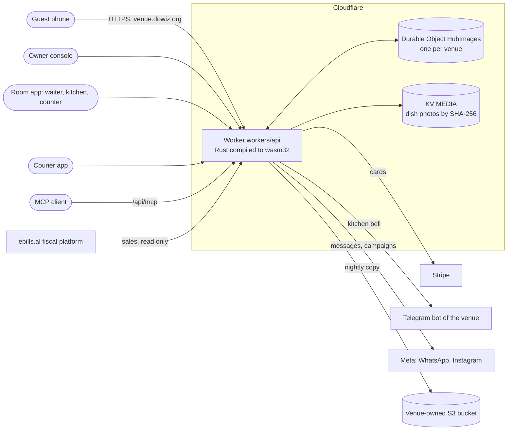
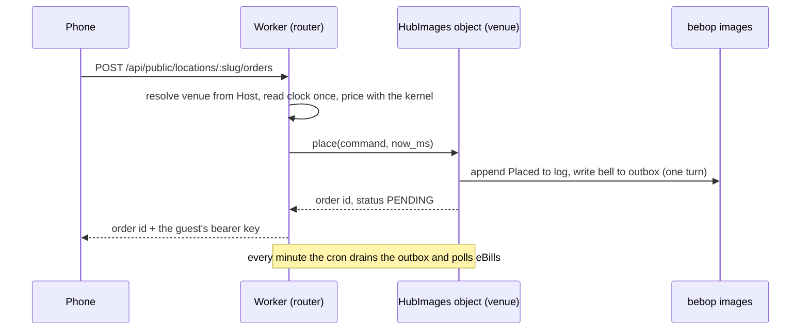
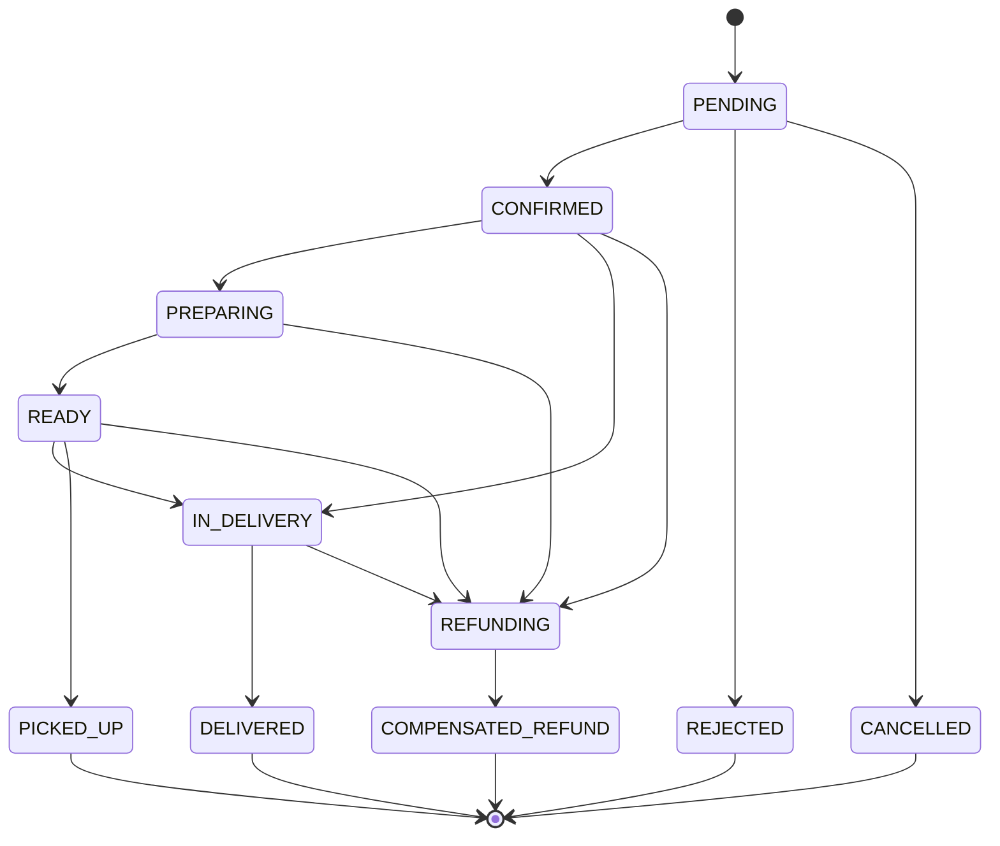
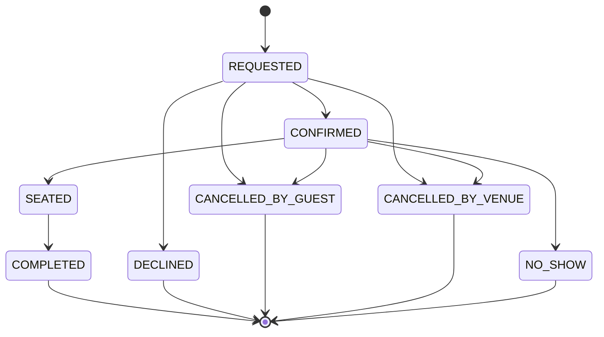
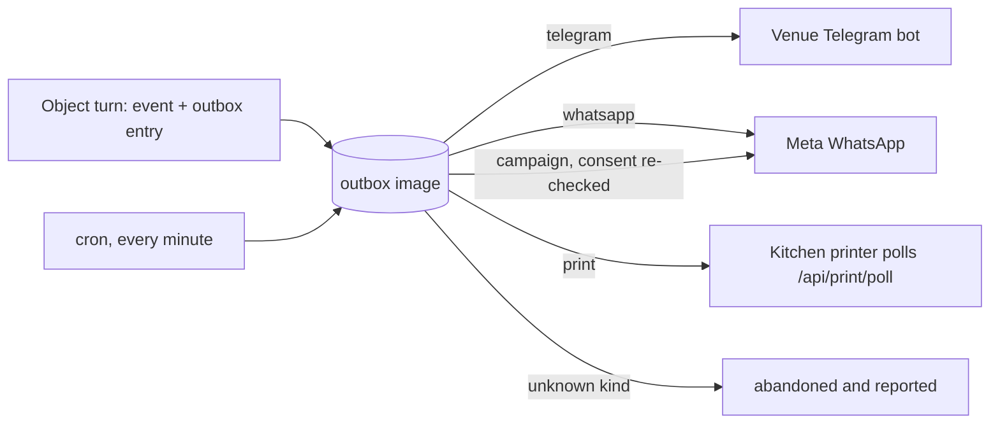
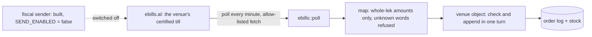

# dowiz

[](https://github.com/SyniakSviatoslav/dowiz/actions/workflows/ci.yml)
[](https://github.com/SyniakSviatoslav/dowiz/actions/workflows/health-cron.yml)
[](https://github.com/SyniakSviatoslav/dowiz/actions/workflows/key-flows.yml)
[](LICENSE)

**One system for a restaurant: ordering, the dining room, delivery and the till.**
Each venue gets its own app on its own subdomain, its own store of records, and a deterministic
Rust kernel that decides every order and every amount in integers.

- **Shqip:** dowiz është një sistem për restorantin: porositë, salla, dorëzimi dhe arka, në domenin
  e vetë lokalit. Udhëzuesi për çdo rol është në [`docs/wiki/`](docs/wiki/Home.md) (anglisht).
- **Українською:** dowiz — одна система для закладу: замовлення, зал, доставка й каса, на власному
  піддомені закладу. Посібники за ролями — у [`docs/wiki/`](docs/wiki/Home.md) (англійською).

<!-- media: 20-second screen recording of a guest ordering on a phone, from menu to live tracking (video lane fills this) -->

Live today: **Dubin & Sushi, Durrës** at `sushi-durres.dowiz.org` (the same venue also answers at
`dubin-sushi.dowiz.org`), with 165 dishes in Albanian, English and Ukrainian, delivery, pickup and
dine-in. The platform's landing page and waiting list are at `dowiz.org`. Open source under
AGPL-3.0; trademark terms in [`TRADEMARK.md`](TRADEMARK.md), contribution terms in [`DCO`](DCO).

---

## Contents

- [What dowiz is](#what-dowiz-is)
- [The four apps and who uses them](#the-four-apps-and-who-uses-them)
- [Features by role](#features-by-role)
- [Architecture](#architecture)
- [Repository layout](#repository-layout)
- [Quick start](#quick-start)
- [Testing](#testing)
- [Deployment](#deployment)
- [Security and privacy](#security-and-privacy)
- [Roadmap](#roadmap)
- [Contributing](#contributing)

---

## What dowiz is

A venue's ordering, room and delivery on one Cloudflare Worker, with **one Durable Object per
venue** holding that venue's records as **bebop images**: append-only, content-chained, pointer-free
files that the Rust side, a wasm32 module and an independent Python oracle all read the same way.
There is no shared database and no SQL (`tools/gates/no-sql.sh` holds that at zero).

Design commitments, each held by code or a gate rather than by a paragraph:

| Commitment | What it means here | Held by |
|---|---|---|
| One venue, one store | every request resolves its venue once, from the Host header; each venue's images live in its own object | `tools/gates/one-venue.sh`, `tools/gates/one-image.sh`, `tools/gates/no-sql.sh` |
| Money is integers | minor units in `i64`/`i128`, currency-typed, overflow-checked; VAT as parts per million | `crates/dowiz-core/src/money.rs`, `tools/gates/float-money.sh` |
| An order is a state machine | `decide -> Event`, `state = fold(events)`; an illegal transition is an error | `crates/dowiz-core/src/order_machine.rs` |
| The clock is read once | the Worker reads the time at the entry point and passes it down | `tools/gates/clock.sh` |
| Offline taps are safe to replay | a courier's queued tap carries an `Idempotency-Key`; the server answers a replay with the first answer | `workers/api/src/idempotency/`, `tools/gates/idempotent.sh` |
| Nobody is scored | no rating, ranking or tier of a courier, customer or staff member | `tools/gates/no-scoring.sh`; routing enums have no `Ord` |
| Marketing needs consent | a send needs a `Consented` value that only the consent fold can produce | `tools/gates/consent.sh` |

dowiz runs **beside** a venue's certified fiscal till, not instead of it: it imports the till's
sales from ebills.al into the same order log (read direction only, see
[eBills](#ebills-import-direction-only)). dowiz is not a certified fiscal device.

## The four apps and who uses them

All four are vanilla-JS progressive web apps served from `workers/api/public/` by the same Worker,
on the venue's own host. Status words and currencies are generated from the kernel by
`tools/gen-vocab`, never retyped (`tools/gates/vocab.sh`).

| App | Path | Who | Source |
|---|---|---|---|
| Storefront | `/` | guests | `workers/api/public/store/` |
| Owner console | `/admin/` | the owner | `workers/api/public/admin/` |
| Room app | `/room/` | waiters, counter managers, kitchen staff | `workers/api/public/room/` |
| Courier app | `/courier/` | couriers | `workers/api/public/courier/` |

The platform landing page and hub creation live at `dowiz.org` (`workers/api/public/platform/`).
Staff permissions are a closed set of signed capabilities (`Advance`, `TakeOrders`, `TakePayment`,
`Void`, `OpenTill`) with four presets: Owner, Kitchen, Counter-Manager, Waiter
(`crates/dowiz-hub/src/caps.rs`).

<!-- media: four phone screenshots side by side, one per app (video lane fills this) -->

## Features by role

Only what is in the tree today. Work in progress is under [Roadmap](#roadmap).

### Guest (storefront)

- Menu, search, basket and checkout in Albanian, English and Ukrainian; installable as a PWA.
- Delivery, pickup or dine-in, a closed set of fulfilment kinds priced by one pricer for the preview
  and the checkout.
- Live tracking with a map and a waiting time the kernel computes in whole minutes from the venue's
  own kitchen profile and queue (`workers/api/src/eta.rs`).
- Book a table without an account; the booking has a share link a second phone can open and cancel
  (`workers/api/src/booking/`).
- Order from the table through a signed per-table QR link; the round joins the table's open bill
  and waits for staff to confirm it.
- Consent to marketing is asked for, recorded with its wording, and can be withdrawn.
- Card payments go browser-to-Stripe when the venue has set its Stripe keys; no type in the Worker
  can hold a card number (`workers/api/src/stripe.rs`).

### Owner (console)

- **Orders:** accept, reject, advance, assign a courier, refund an order past `PENDING`, and each
  order's kitchen-ticket state; an aggregator order (Wolt, Glovo, Baboon) can be entered by hand and
  is placed once.
- **Menu:** dishes, categories, photos, per-language names, menu import, allergens and modifiers.
- **Stock:** supplies, recipes, CSV import with a dry run, write-offs that name who signed them, a
  waste report, and a dish's cost as a weighted average of purchases. (The ledger is built and
  tested; it stays switched off on a venue until the venue enters recipes and supplies.)
- **Couriers and staff:** invite, activate, suspend, change a staff member's role.
- **Room:** bookings (confirm, decline, book by phone), a floor-plan editor, table QR codes.
- **Customers:** a record card that holds only what a fold cannot derive, an append-only consent
  log, "forget this person" in place, and linking two phone spellings of one person without merging
  them. Every look at a contact detail is itself logged.
- **Marketing:** promotions, a stamp card (off by default), approved WhatsApp template campaigns to
  consented customers only, and posts.
- **Reports:** analytics in the venue's own time zone, an exceptions report of voids, refunds and
  till gaps with a signer on every row, and `/api/owner/health` with image gauges against their real
  ceilings and the outbox depth.
- **Integrations**, each with a "prove it" check (`workers/api/src/integrations.rs`): a venue-owned
  Telegram bot for the kitchen bell, WhatsApp and Instagram through one Meta webhook, a nightly copy
  to an S3-compatible bucket the venue owns, the venue's own AI endpoint for the assistant, a
  kitchen printer that pulls its own tickets, eBills import, and the hub as an MCP server at
  `/api/mcp` so an agent can do what the console does.

### Waiter, counter manager, kitchen (room app)

- Claim an invite, sign in, see the floor with each table's state (free, booked, ordering, waiting
  for food, paying, to clear; derived by a fold).
- Open a table, add rounds, amend in intent form (add, remove, re-count, comp); a stale edit from a
  second tablet is refused rather than overwriting.
- Confirm rounds that guests placed from the table QR.
- Pay: split a bill across as many payments as it takes, in EUR or ALL, with a tip; over-payment is
  refused and a settled bill can no longer be amended.
- Move lines between rounds, move a sitting to another table, mark a table cleared. (Refunds are
  taken from the owner console.)
- The till: open, blind count, close, pay in, pay out, per currency; tips per person.
- Kitchen staff (Kitchen preset) mark a round seen (`/api/staff/orders/:id/kitchen-ack`) and
  advance it to ready, through the same routes the console's buttons call. There is no separate
  kitchen display yet; tickets reach the kitchen through the Telegram bell and the printer rail.

### Courier (courier app)

- One job on screen at a time: take the offer, pick up, deliver with a cash handover, or record
  "refused at the door", which ends the order through a refund.
- Taps made without signal wait in IndexedDB and replay with an `Idempotency-Key`
  (`workers/api/public/lib/outbox.js`); reopening the app underground still shows the job.
- Shift on and off, earnings and history. A courier's login is scoped to the host's venue.

## Architecture

Deeper diagrams and the reasoning behind them: [`docs/architecture.md`](docs/architecture.md).

### System context



### Worker, Durable Object, bebop images

One object per venue (`id_from_name(location_id)`, `workers/api/src/hubstore.rs`) is the single writer for that venue. A command such as
placing an order runs in one object turn: the event is appended to the log image and any message it
owes is written to the outbox image in the same turn, or nothing is written.



The images a venue owns include `log`, `catalog`, `settings`, `posts`, `stock`, `people`,
`consent`, `bookings`, `ledger`, `till`, `outbox`, `idem`, `inbox`, `threads`, `campaign`,
`rails`, `audit`, `i18n` and `ops` (constants `IMAGE_*` under `workers/api/src/`). The format:
`crates/bebop-store` (Rust, zero dependencies), `crates/bebop-wasm` (the same reader in wasm32),
and `bebop-lang/` (the language the format came from).

### Order lifecycle (the kernel's state machine)

Transcribed from `allowed_next` in `crates/dowiz-core/src/order_machine.rs`.



`SCHEDULED` exists as a status but is scaffold-only: every transition into or out of it is refused.

### Booking lifecycle

Transcribed from `allowed_next` in `crates/dowiz-core/src/reservation.rs`.



### The outbox and the rails

A message owed to a third party is written, never awaited inline (`workers/api/src/outbox.rs`,
`workers/api/src/outbox/rails.rs`). The minute cron drains it with backoff (10 s, 30 s, 2 min,
5 min, then 10 min) and abandons an entry after six tries, loudly: the depth and the oldest entry
show on the owner's health pane. Stripe, the venue's AI endpoint and Meta sit behind a circuit
breaker kept in the venue's object (`workers/api/src/rail.rs`).



### eBills: import direction only



The sender that would issue invoices exists in `workers/api/src/fiscal/` but
`SEND_ENABLED = false` in `workers/api/src/fiscal/mod.rs`: the cron returns early and the arm route
answers 409. dowiz does not fiscalise sales.

## Repository layout

There is no cargo workspace: each crate is standalone and is entered with `cd`.

| Path | What it is |
|---|---|
| `workers/api/` | the Cloudflare Worker (Rust), its Durable Object (`hubdo.rs`), and `public/`, the browser apps |
| `crates/dowiz-core/` | the kernel: order and booking state machines, money, tax, PQ primitives, ports |
| `crates/dowiz-hub/` | one venue's images as pure logic: order log, tables, capabilities, consent, forget, stock, room deciders |
| `crates/bebop-store/`, `crates/bebop-wasm/` | the bebop image format in Rust and its wasm32 reader with the four-reader gate |
| `kernel/` | `dowiz-kernel`, the std facade over `dowiz-core`, with benches and examples |
| `bebop-lang/` | the bebop language: self-hosting compiler, seed, standard modules, oracles |
| `tools/gates/` | the code-quality gates and their mutation proofs; `run-all.sh` runs them all |
| `tools/gen-vocab/`, `tools/native-spa-server/`, `tools/eqc-rs/` | vocabulary generator, native twin server, equation compiler |
| `tools/live-checks/` | read-only production probes (`health.sh`) |
| `e2e/` | live audits (`gates/`), browser regression (`kit-regression/`), per-role live walks (`walk/`) |
| `engine/`, `apps/courier/`, `bebop2/`, `mesh-adapter/` | render engine, native courier surface, mesh protocol: tested, not part of the live product |
| `docs/` | [documentation index](docs/README.md), design blueprints, runbooks, [wiki pages](docs/wiki/Home.md) |

## Quick start

Requirements: Rust via rustup (the repo pins 1.96.1 in `rust-toolchain.toml`; the wasm32 target is
needed for the Worker), Node 22, Python 3.

```sh
git clone https://github.com/SyniakSviatoslav/dowiz.git && cd dowiz

# The crates the live product is made of (what CI's hub job runs)
bash scripts/verify-hub.sh

# One crate at a time: never `cargo -p` from the root (there is no workspace)
cd crates/dowiz-hub && cargo test && cd -

# Every gate, one table of exit codes
sh tools/gates/run-all.sh

# Browser-side unit tests
node --test $(find workers/api/public -name '*.test.mjs' | sort)

# Run the Worker locally (needs worker-build on PATH; not exercised by CI)
cd workers/api && npx --yes wrangler@4 dev
```

Environment notes for the Android development box (process cap, `slot.sh`) are in
[`docs/operations.md`](docs/operations.md#the-development-box).

## Testing

Full guide: [`docs/testing.md`](docs/testing.md).

| Layer | Command | What it proves |
|---|---|---|
| Kernel and hub | `cd crates/dowiz-core && cargo test` (also `dowiz-hub`, `bebop-store`, `workers/api`) | the state machines, money, tax, image format, every route handler's pure half |
| Room deciders in wasm | `cd crates/bebop-wasm && cargo test --features decide` | amend and pay run byte-identically in the browser and the server |
| Four readers | `sh crates/bebop-wasm/gate.sh` | native, wasm32, Python (and bebop on AArch64) read one image to one number |
| Browser units | `node --test` over `workers/api/public/**/*.test.mjs` | money formatting, booking time, floor plan, replica fold, UI components |
| Gates | `sh tools/gates/run-all.sh` | each code-quality rule, each proved able to fire first |
| Conservation laws | `node e2e/gates/conservation.prove.mjs` (stub); `conservation.mjs` against a live venue with an owner token | thirteen laws (1 to 12, and N for fiscal codes): the register adds up |
| Real browser | `node e2e/kit-regression/outbox.mjs`, `courier-cold.mjs` | the courier's offline queue and cold start, served from disk |
| Live walks | `e2e/walk/*.mjs` against a QA host | each role through the real UI, every step read back through the API |

Static count of `#[test]` functions on 2026-09-24 (`grep -rE '#\[(tokio::)?test\]'`):
`dowiz-core` 3,658, `workers/api` 843, `kernel` 472, `dowiz-hub` 461, `native-spa-server` 92,
`bebop-store` 35.

## Deployment

One Worker serves every venue and the platform: `workers/api/wrangler.toml` (Durable Object class
`HubImages`, KV `MEDIA`, two crons: `17 3 * * *` for the nightly copy and witness, `* * * * *` for
the outbox, eBills poll and fiscal sweep). Deploy with a token that has Workers Scripts write:

```sh
cd workers/api
export PATH="$HOME/.cargo/bin:$PATH"          # wrangler runs `worker-build --release` through /bin/sh
npx --yes wrangler@4 deploy
bash scripts/smoke.sh https://<slug>.dowiz.org  # read-only post-deploy smoke
```

A new venue is two steps: `POST /api/platform/hubs`, then `bash tools/platform/attach-host.sh <slug>`
until the wildcard route is restored. Production is probed every 15 minutes by
[`health-cron.yml`](.github/workflows/health-cron.yml). Runbooks: [`docs/operations.md`](docs/operations.md).

## Security and privacy

- **Tenant isolation.** The venue is decided once per request from the Host header, and each
  venue's records live in its own object; `tools/gates/one-venue.sh` refuses a handler that
  authorises one venue and acts on another.
- **Write routes.** The 2026-09-21 red-team pass deleted two unauthenticated write routes and closed
  three route families (commit `727bc591`); the principal-binding gaps still open are listed in the
  2026-09-24 audit (Wave G, row G6). An order
  id alone is not a key: `GET /api/order/:id` without the guest's token answers 401 or 404.
- **Tokens** are HMAC-SHA256 with the algorithm fixed in code (`crates/dowiz-hub/src/token.rs`,
  `workers/api/src/auth.rs`).
- **Signatures.** `crates/dowiz-core/src/pq/` holds an ML-DSA-65 (FIPS 204) implementation verified
  byte-exact against the vendored NIST ACVP vectors. It is behind the kernel's off-by-default `pq`
  feature and is not on the live request path.
- **Off-site copies.** The nightly copy to the venue's bucket carries a manifest with each image's
  SHA-256. A sealing path for those copies exists in `workers/api/src/cloud/seal.rs` and is switched
  off: it seals nothing until the operator sets `BACKUP_SEAL_PK`. dowiz makes no claim of
  post-quantum encryption.
- **Personal data.** Consent is an append-only log (who, when, which channel, which wording);
  withdrawal is a new record. A person can be forgotten in place: personal fields emptied, the record
  keeps its id so the chain still verifies, and a `Forgotten` event declares it. No participant is
  rated, ranked or tiered.
- **Reporting a vulnerability:** see [`SECURITY.md`](SECURITY.md).

## Roadmap

The current entry point is [`docs/design/ROADMAP-2026-09-22.md`](docs/design/ROADMAP-2026-09-22.md);
the latest defect audit is
[`docs/design/AUDIT-BUGS-BLINDSPOTS-TESTS-2026-09-24.md`](docs/design/AUDIT-BUGS-BLINDSPOTS-TESTS-2026-09-24.md)
(40 defects, 11 proved by running them, and the fix list "Wave G"). Planned, not built:

- **Wave G:** the audit's fixes, each landing with the gate that guards it (refusals recorded for
  idempotent replays, the courier shell offline, venue-day time handling for bookings, refunds that
  reverse wallet spends and the till).
- **Wave F, launch gaps:** supplier invoices as one receipt, Wolt webhook intake, a QA venue for
  walks and soaks, splitting the largest files below the 300-line rule, per-venue alarms instead of
  one fan-out cron, the wildcard route, and a load soak
  ([`BLUEPRINT-LAUNCH-GAPS-2026-09-24.md`](docs/design/BLUEPRINT-LAUNCH-GAPS-2026-09-24.md)).
- **Wave P, privacy and agents:** a personal-data registry in code with a gate, erasure across every
  store and backup, a 30-day request intake, retention jobs, a privacy notice per venue, and an
  OAuth-protected MCP surface for every role
  ([`BLUEPRINT-GDPR-AND-MCP-2026-09-24.md`](docs/design/BLUEPRINT-GDPR-AND-MCP-2026-09-24.md)).
- **Sealed off-site copies switched on** (operator step: generate the key off-platform, set
  `BACKUP_SEAL_PK`).
- **A kitchen display** for the Kitchen preset.
- **Fiscal send** stays off until the operator decides otherwise.

Decided against, with the condition that would reopen each: CRDTs for money and orders (reopen for a
second writer that cannot share the object, such as an offline till), a general effect system, and
an in-process event bus. Reasons in the roadmap, section 4.

## Contributing

Read [`CONTRIBUTING.md`](CONTRIBUTING.md) and [`docs/code-quality.md`](docs/code-quality.md). In
short: sign off every commit (DCO), keep files under 300 lines with tests beside the code, give every
refusal test a positive twin, prove a new gate can fire before trusting it, and keep money in
integers. Be kind: [`CODE_OF_CONDUCT.md`](CODE_OF_CONDUCT.md).

Further reading: [`CLAUDE.md`](CLAUDE.md) (build model and kernel authority),
[`DECISIONS.md`](DECISIONS.md) (red-line rulings), [`MANIFESTO.md`](MANIFESTO.md) (the thesis),
[`CHANGELOG.md`](CHANGELOG.md), [`bebop-lang/README.md`](bebop-lang/README.md).
