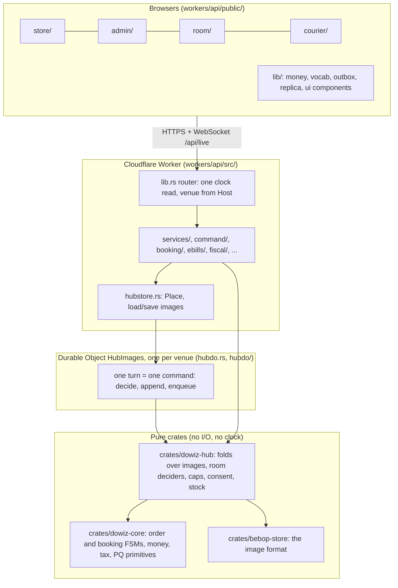
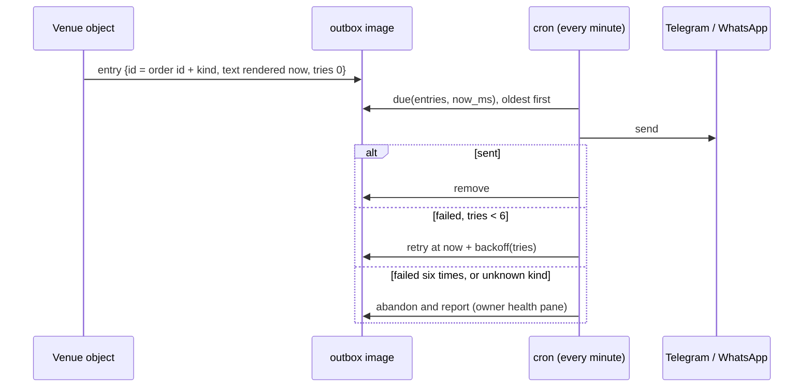

# Architecture

How a request becomes a record, and why each layer is shaped the way it is. Every path below is a
file you can open; if one is wrong, `tools/gates/paths.sh` is the model for catching it.

## Layers



- **`crates/dowiz-core`** is the kernel: `order_machine.rs` (the order FSM), `reservation.rs`
  (the booking FSM), `money.rs`, `tax.rs`, `pq/`. It has no clock, network, RNG or float on the
  decision path, so any node folding the same events reaches the same state.
- **`crates/dowiz-hub`** is one venue's records as pure logic over bebop images: the order log,
  tables, capabilities (`caps.rs`), consent, forget, stock, and the room's amend and pay deciders
  (`room/`), which also compile into the wasm32 module in `crates/bebop-wasm` (`--features decide`)
  so the room app can run the same decision the server runs.
- **`workers/api`** is the Worker: routing, authentication, the Durable Object, the cron, and the
  rails to third parties. `kernel/` is a std facade that re-exports `dowiz-core`.
- **`workers/api/public`** holds the browser apps. They draw what the server answers; status words
  and currencies come from `lib/vocab.js`, generated by `tools/gen-vocab` from the kernel.

## One request

```mermaid
sequenceDiagram
  autonumber
  participant B as Browser
  participant R as Router (lib.rs)
  participant H as Handler
  participant O as Venue object (hubdo.rs)
  participant K as dowiz-hub / dowiz-core
  B->>R: request on venue.dowiz.org
  R->>R: now_ms = Date::now() (the only clock read, tools/gates/clock.sh)
  R->>H: Req { now_ms } + route params
  H->>H: authenticate; resolve the venue once (tools/gates/one-venue.sh)
  H->>O: command (place, advance, assign, amend, pay, refund, ...)
  O->>K: decide(state, command, now_ms)
  K-->>O: Event or refusal
  O->>O: append event to log; write owed messages to outbox (same turn)
  O-->>H: answer
  H-->>B: JSON
  O--)B: the event, down the venue's sockets (live.rs)
```

Rules this shape enforces:

- **One clock read per entry point.** `lib.rs` reads `Date::now()` once for a request and once for
  a cron firing; handlers take the instant as data. `tools/gates/clock.sh` holds the count at zero.
- **One image written per transaction** (`tools/gates/one-image.sh`). A handler that needs two
  images changed is a command the object executes in one turn.
- **Idempotent replays.** A route a phone may replay (`tools/gates/idempotent.sh` lists them) goes
  through `workers/api/src/idempotency/`: the first answer is stored under the `Idempotency-Key`
  and a replay gets that answer back.
- **Live updates are the same events.** `GET /api/live` upgrades to a WebSocket tagged at connect
  time as one order (a guest), the venue (an owner) or one courier; the object pushes what it
  wrote. Polling with `?since=` still works for a client that missed something.

## The venue's images

A venue's state is a set of named bebop images inside its object, stored in 96 KiB chunks
(`hubdo.rs`, `CHUNK`) with the meta written last. Names are `IMAGE_*` constants:

| Image | Holds | Defined in |
|---|---|---|
| `log` | the order event log (append, content-chained) | `workers/api/src/hubstore.rs` |
| `catalog`, `settings`, `posts`, `stock` | menu, venue settings, posts, supplies and recipes | `workers/api/src/hubstore.rs` |
| `people`, `ops`, `i18n`, `audit` | customer cards, operational state, translations, audit trail | `workers/api/src/hubstore.rs` |
| `bookings` | reservations and their history, one aggregate | `workers/api/src/booking.rs` |
| `ledger` | wallet postings, each transaction carrying its own postings | `workers/api/src/wallet.rs` |
| `till` | shifts, counts, pay in and out | `workers/api/src/command/till.rs` |
| `outbox` | messages owed to Telegram, WhatsApp, campaigns, the printer | `workers/api/src/outbox.rs` |
| `idem` | stored answers for idempotent routes | `workers/api/src/idempotency/mod.rs` |
| `consent` | the consent log | `workers/api/src/services/customers/consent_log.rs` |
| `campaign` | campaign sends | `workers/api/src/services/campaigns/campaign.rs` |
| `inbox`, `threads` | conversations | `workers/api/src/channels.rs`, `workers/api/src/social.rs` |
| `rails` | circuit-breaker state for Stripe, the AI endpoint and Meta | `workers/api/src/rail.rs` |

The platform itself (registry of venues, waiting list, witness log) lives in one more object,
named `PLATFORM` (`workers/api/src/platform_store.rs`).

## The bebop image format

The product uses the bebop **format**; the bebop **language** (`bebop-lang/`) runs beside the
product, not inside the Worker.

- **Pointer-free and self-describing.** Two CRC-checked superblocks (a reader takes the newest valid
  one, or nothing); an append-only arena of objects whose header carries a layout digest, length,
  payload CRC and generation; every reference is an object-relative offset. The same bytes are read
  by `crates/bebop-store` (Rust, zero dependencies), `crates/bebop-wasm` (wasm32) and an
  independent Python oracle (`crates/bebop-wasm/oracle.py`).
- **Four readers must agree.** `crates/bebop-wasm/gate.sh` folds one fixture image to one number
  in each reader; a cut image must be refused by all of them; the wasm32 reader's size is a ratchet
  (`crates/bebop-wasm/bytes.baseline`, 30,863 bytes). `bebop.bin` is AArch64-only, so on an x86 CI
  runner that reader prints NOT MEASURED and the gate relies on the other three.
- **Append in O(1).** One object per event with the root relinked (`crates/bebop-store/src/evlog.rs`).
- **Tables without a query planner.** Bounded sets (people, dishes, keys) live in a sorted
  key/value image where every access path is a key written on purpose and a record owns its index
  keys (`crates/dowiz-hub/src/table.rs`).
- **Content-chained and witnessed.** Every order-log id commits to the id before it. A chain cannot
  see a record removed from the end, so the tip is written nightly to the platform object's witness
  log and to the venue's off-site copy (`workers/api/src/witness/`).
- **Every number in an image is a claim.** Lengths and offsets are bounded against the bytes
  present; a slice that does not fit is refused, never truncated.

Stated limits: one writer per venue by design; the whole image is loaded per request; compacted
key/value images have real ceilings (for example `PEOPLE_BYTES`, 2 MiB), which
`/api/owner/health` reports against.

## Order and booking state machines

The order FSM (`crates/dowiz-core/src/order_machine.rs`) and the booking FSM
(`crates/dowiz-core/src/reservation.rs`) are drawn in the [README](../README.md#order-lifecycle-the-kernels-state-machine).
Properties worth knowing:

- An illegal transition is an error (`TransitionError::Illegal`), never a silent no-op.
- `SCHEDULED` is scaffold-only: any transition touching it is `ScaffoldDisabled`.
- `DELIVERED` and `PICKED_UP` are terminal. A refund is reachable from every state after
  `CONFIRMED` up to delivery, through `REFUNDING` to `COMPENSATED_REFUND`, where the order's money
  nets to zero.
- The order FSM is checked against a golden signature (`FSM_GOLDEN_SIGNATURE`), which
  `tools/gen-vocab` also cross-checks, so a change to the machine fails a test before it reaches a
  browser.
- The booking FSM builds its adjacency at compile time from the same `allowed_next`, and a test
  asserts the two agree.

## Messages to the outside: outbox and rails



- The entry id is the order id plus the kind, so a retried command enqueues one message, not two.
- The text is rendered at enqueue time, so a later menu change cannot alter a ticket.
- A rail that is not configured has not failed: the entry waits and shows on the health pane.
- Campaign entries re-check the consent fold at send time; a withdrawal since queueing removes the
  entry unsent (`workers/api/src/services/campaigns/`).
- The kitchen printer pulls its own tickets (`workers/api/src/print_rail.rs`,
  `POST /api/print/poll`); the cron never pushes a print job.
- Stripe, the venue's AI endpoint and Meta sit behind a consecutive-failure circuit breaker whose
  state lives in the venue's `rails` image (`workers/api/src/rail.rs`), because a Worker isolate's
  memory does not survive between requests.

## eBills (read direction only)

The venue's certified fiscal till on ebills.al is the source of truth for sales it rang up. The
minute cron polls it through an allow-listed client (`workers/api/src/ebills/client.rs`,
`judge.rs`, `fetch.rs`), maps each sale (`map.rs`: amounts must be whole lek, unknown status words
are refused and shown to the owner unmapped), and the venue's object checks and appends it in one
turn (`workers/api/src/hubdo/ebills.rs`). A void puts back what its sale served.

The sender in `workers/api/src/fiscal/` is built and switched off (`SEND_ENABLED = false` in
`workers/api/src/fiscal/mod.rs`): the cron sweep returns and the arm route answers 409.

## Crons

`workers/api/wrangler.toml`:

| Cron | Runs | Code |
|---|---|---|
| `17 3 * * *` | nightly off-site copy to the venue's bucket, rotation, prune, witness | `workers/api/src/cloud.rs` (`nightly`), `workers/api/src/witness/` |
| `* * * * *` | outbox drain, eBills poll, fiscal sweep (returns while switched off) | `workers/api/src/lib.rs` (`scheduled`) |

## What is not part of the live product

`engine/`, `apps/courier/` (a wgpu surface), `bebop2/` and `mesh-adapter/` (a mesh delivery
protocol), `agent-*` crates and `web/` are tested but are not served to a venue.
`tools/native-spa-server` is a second, native implementation of the owner, courier and storefront
routes for a venue that wants to run on its own machine; CI tests it.

## Decided against

From `docs/design/ROADMAP-2026-09-22.md`, section 4: CRDTs for money and orders (the object is
already a single writer; reopen for a second writer that cannot share it, such as an offline till),
a general effect system in Rust, and an in-process event bus.
