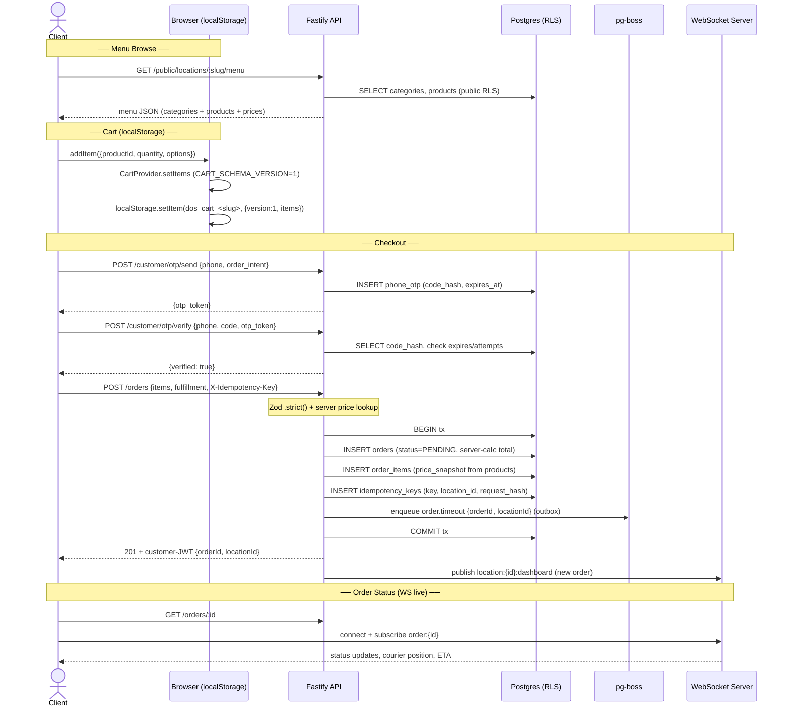
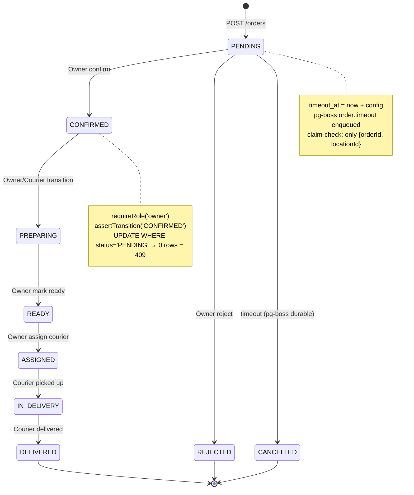
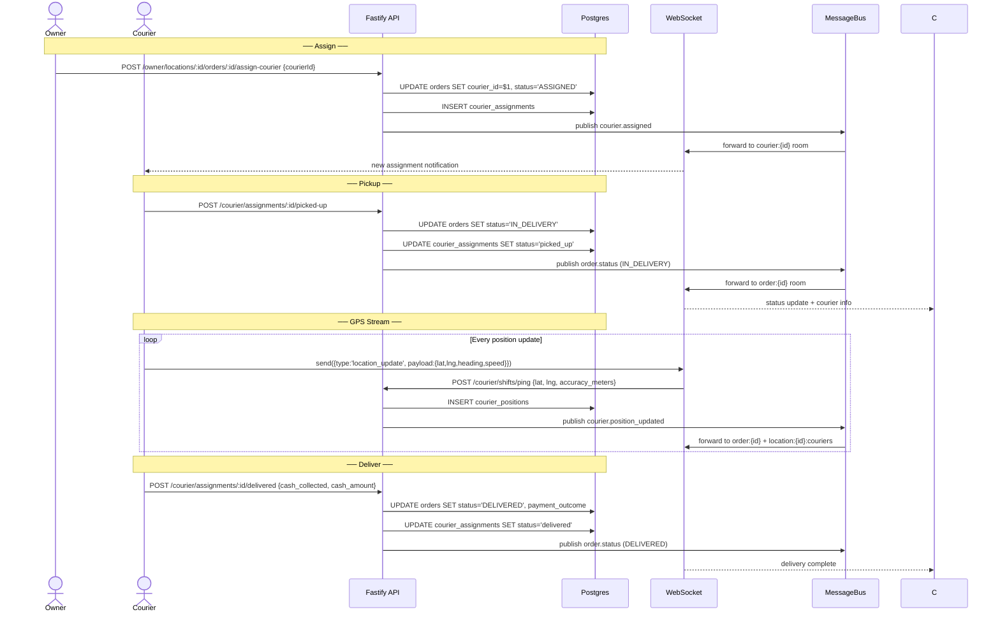
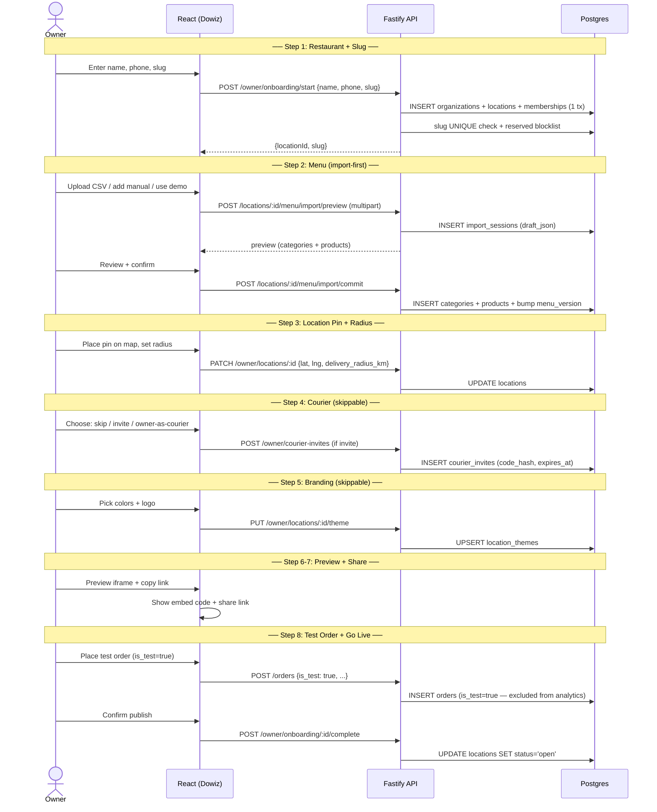
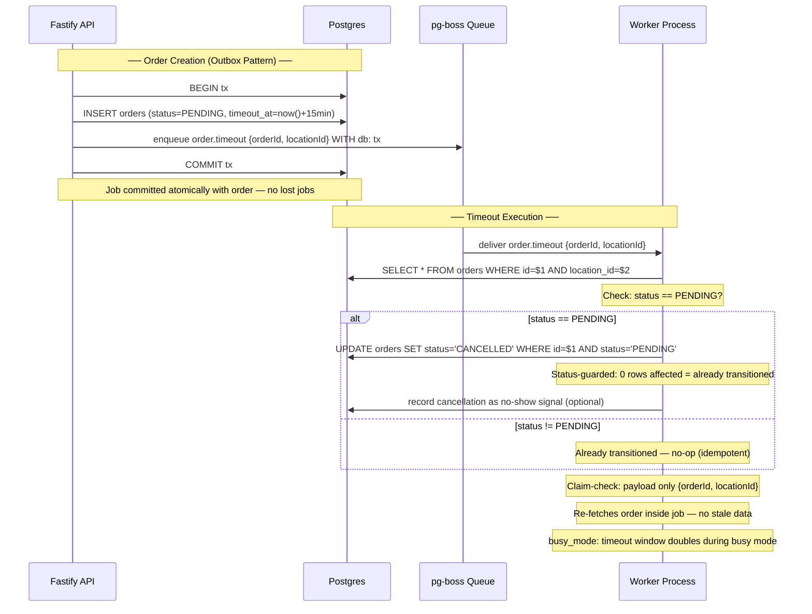

# Flow: Customer Order (menu → cart → checkout → status)

---

## Flow: Order Lifecycle (State Machine)

---

## Flow: Courier Delivery (assign → pickup → deliver)

---

## Flow: Onboarding (8-step wizard)

---

## Flow: Durable Timeout (Order Cancellation)

