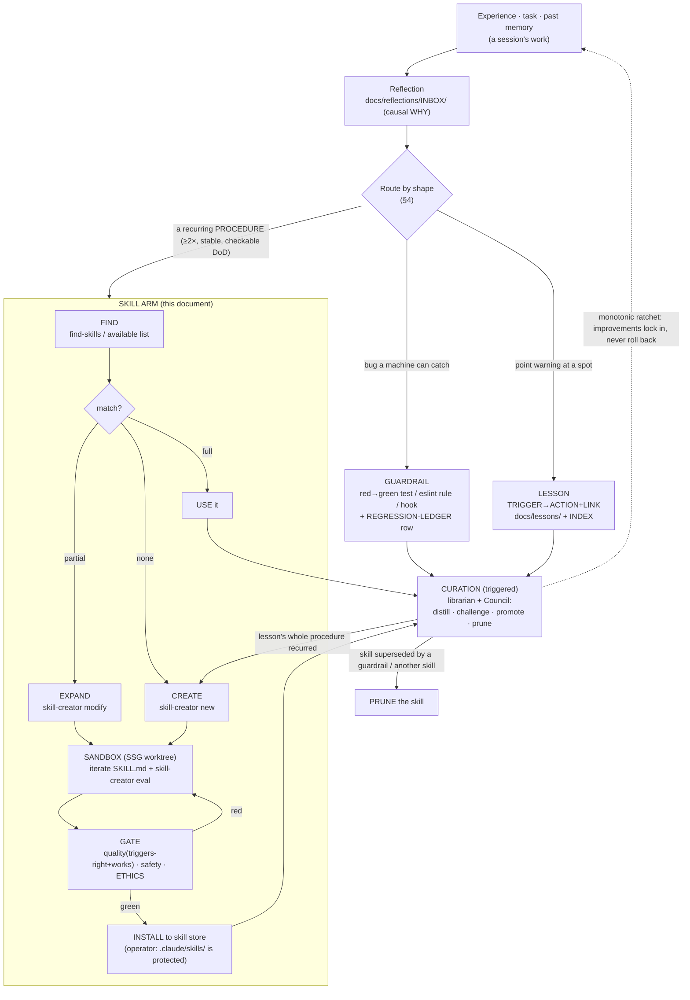

# Skill Self-Evolution — universal harness rule

> **Status:** design + registry + one drafted skill (this doc · `loops/registry.md` entry `skill-evolution` ·
> DRAFT card `loops/skill-evolution.yaml` · drafted skill `docs/design/harness/proposed-skills/max-lanes-orchestration/`).
> **Operator directive (2026-07-03):** *"make agents self improve — find and use, expand, or even create
> new skills based on their experience, tasks, past memories — universal rule."*
> **Connects to:** `CLAUDE.md` (Self-improvement loop · Ethics Charter · Agent Discipline · Task-Exit Rule),
> the Sandbox-Swarm-Gate loop (`docs/design/harness/SANDBOX-SWARM-GATE.md` — the sandbox/gate substrate this
> reuses), the skill tooling (`skill-creator`, `find-skills`), the loop system (`loops/registry.md`,
> `loop-orchestrator`, `loop-architect`), the curator (`.claude/agents/librarian.md`), and the ratchet stores
> (`docs/regressions/REGRESSION-LEDGER.md`, `docs/lessons/`, `docs/reflections/`).

## 1. What this is (and the problem it names)

The self-improvement ratchet in `CLAUDE.md` today turns experience into exactly **two** deterministic
outputs: a **guardrail** (a machine gate that blocks a regression) and a **lesson** (an advisory nudge before
an edit). That covers *bugs* (guardrail) and *point warnings* (lesson) — but it has **no home for a
procedure**. When an agent works out *how to do a whole class of task well* — partition a goal into
collision-free lanes, run a sandbox-swarm-gate, drive an audit remediation — that hard-won procedure
evaporates at the end of the session. The next agent re-derives it from scratch, or worse, re-derives it
*wrong* and repeats a mistake the last one already learned from.

A **skill** is the missing third output: a **reusable procedure** (`SKILL.md` — a sharp description that
triggers it, plus the steps and the definition-of-done) that the model loads and executes. This document
makes **skill evolution a first-class arm of the ratchet**, on equal footing with guardrails and lessons,
under one universal rule:

> **Every agent, on every task, extends its own capability from experience: FIND an existing skill before
> improvising, USE it, EXPAND it when it is close, or CREATE a new one when a procedure has genuinely
> recurred — and every new or expanded skill passes the same quality + safety + Ethics gate as code, iterated
> in a sandbox, merged by the gate.**

This does not replace the guardrail/lesson ratchet. It **extends** it. The same reflections, the same
`librarian`, the same Council, the same sandbox and gate — now also curate a skill dimension.

## 2. The universal rule — find → use → expand → create

Four moves, cheapest first. The whole point is that **reuse beats reinvention** and **creation is earned,
not reflexive** — a new skill is a standing claim on every future agent's context budget, so the bar is high.

| Move | When | How | Cost |
|------|------|-----|------|
| **FIND** | Before improvising any multi-step procedure. | Scan the available-skills list; `find-skills` / `search_codebase` for a match by intent, not just keyword. | ~0 — a look |
| **USE** | A skill matches the task. | Invoke it; follow its steps and DoD. Do not paraphrase it from memory — load it. | ~0 |
| **EXPAND** | A skill is *close* but missing a step your task actually needed (a new state, an edge case, a better sub-step you had to work out). | `skill-creator` in modify mode → add the step, re-run its eval, gate the diff. Prefer expanding an existing skill over spawning a near-duplicate. | low |
| **CREATE** | No skill fits **and** the procedure clears the promotion bar (§3). | `skill-creator` from scratch → draft `SKILL.md`, eval, gate, install. | high — earn it |

**Anti-reflex:** do **not** create a skill for a one-off, a trivial task, or something a single existing skill
plus one sentence of context already handles. An over-eager skill store rots into noise that dilutes
triggering for the skills that matter (this is the same failure mode as an ever-growing lesson store — the
`librarian`'s bias-to-prune applies here too, §6).

## 3. When does a process become a skill? (the promotion bar)

A procedure earns skill-hood when **all three** hold — the same shape as the test a process must pass to
become a *loop*, because a skill is the lighter-weight sibling of a loop:

1. **Recurred (≥2×).** It has actually happened more than once — not "might be useful," but "we did this again
   and re-derived it." One occurrence is a note; two is a pattern. *(This repo's lane-collision class has
   recurred at least twice — §8 — which is precisely why the drafted skill is warranted.)*
2. **Stable steps.** The procedure has a repeatable shape — you can write it down as steps that hold across
   instances, not a bespoke one-time sequence.
3. **Checkable DoD.** "Done" is verifiable by an artifact/test/observation, not by vibes. A skill without a
   checkable DoD is a vibe with a filename.

If only **one or two** hold, the right output is a **lesson** (a point nudge) or a **reflection** (raw
material), not a skill — see the routing table in §4.

```
Experience / task / memory produces an insight
        │
        ▼
Is it a *procedure* (how to DO a class of task)?
   │ no ─────────────▶ Is it a *bug a machine can catch*? ─yes─▶ GUARDRAIL (authority)
   │                        │ no
   │                        ▼
   │                   Is it a *point warning* tied to a spot? ─yes─▶ LESSON (advisory)
   │                        │ no
   │                        ▼
   │                   → REFLECTION only (raw material; may promote later)
   │ yes
   ▼
Has it recurred ≥2× · stable steps · checkable DoD?
   │ no ──▶ not yet a skill: LESSON now; keep the reflection; revisit on the next recurrence
   │ yes
   ▼
Does a skill already cover it?
   │ yes, fully ──▶ USE it
   │ yes, partly ─▶ EXPAND it (skill-creator modify)
   │ no ──────────▶ CREATE it (skill-creator new) → SANDBOX → GATE → INSTALL
```

## 4. The three ratchet outputs — skill vs guardrail vs lesson

This is the core of the extension. One insight from experience can produce **any** of these — and a rich
recurrence produces several. Route by *shape*, not by convenience:

| Output | Is | Right artifact when… | Authority | Lives in | Curated by |
|--------|-----|----------------------|-----------|----------|-----------|
| **Skill** | a reusable **procedure** — `SKILL.md`: description (triggers it) + steps + DoD | a multi-step *process* **recurred ≥2×** with **stable steps** + a **checkable DoD**; worth teaching every future agent to do again | **advisory-but-executable** — it guides behavior; the gate/DoD still decide correctness | `.claude/skills/` (drafts in `docs/design/harness/proposed-skills/`) | `skill-creator` (build) + `librarian`/Council (promote/prune) |
| **Guardrail** | a **deterministic gate** — regression test / `eslint-plugin-local` rule / hook that goes **red** on the bug | a *bug class* a machine can **mechanically catch**; you want it to never regress again | **AUTHORITY** — it blocks | `tools/eslint-plugin-local/`, test tree, hooks; row in `REGRESSION-LEDGER.md` | `librarian` (promote red→green) |
| **Lesson** | an **advisory nudge** — `TRIGGER → ACTION + LINK` injected before an edit | a *point insight* tied to a **path glob / error signature**; a "watch out here" not yet mechanizable | **advisory** — informs the editor, never blocks | `docs/lessons/` + `INDEX.md` | `librarian` (distill/challenge/prune) |

**The routing key in one line:** a **procedure** → skill · a **bug a machine can catch** → guardrail · a
**warning tied to a spot** → lesson. They are **not exclusive** — the honest response to a rich recurrence is
often *all three at once* (§8 shows one recurrence producing exactly that).

**Load-bearing distinction (why a skill is not a guardrail):** a guardrail is **authority** — it fails the
build and cannot be argued with. A skill is **advisory-but-executable** — it makes the right procedure the
easy default, but a skill can never *substitute* for a guardrail on a red-line. If a bug class is
machine-catchable, it must get a **guardrail** even if a skill also teaches the procedure; the skill speeds
the human/agent, the guardrail is what actually holds the line. Signals inform; deterministic artifacts
decide — the same law that governs lessons governs skills.

## 5. How it runs alongside lesson → guardrail (it extends, not replaces)

The existing `CLAUDE.md` Self-improvement loop stays exactly as it is. Skill evolution slots in as a **parallel
arm** fed by the **same** reflections and curated on the **same** triggered cadence:



The two arms **share the same reflections, the same sandbox+gate, the same librarian+Council, the same
monotonic-ratchet law.** Nothing about the guardrail/lesson machinery changes; skill evolution is a third
lane off the same intake.

## 6. Curation — the librarian + Council curate the skill dimension too

Skills are curated on the **same triggered cadence** as lessons (after a fix / at stage-close), by the
**same** curator, applying the **same** four-step discipline — now over the skill store as well:

1. **DISTILL.** When a session's procedure clears the §3 bar, distill it into **one** sharp `SKILL.md` (crisp
   description + trigger + steps + checkable DoD). One skill, not three near-duplicates — if two want to
   exist, you have not distilled; collapse or EXPAND an existing one.
2. **CHALLENGE (fresh-model).** Contest the skill as a hostile fresh read: *Does the description actually
   trigger on the right prompts and stay quiet on near-misses?* (run `skill-creator`'s description eval).
   *Do the steps actually work, or is this aspirational?* *Is it genuinely reusable or overfit to one
   session?* If it doesn't survive, mark it low-confidence or drop it.
3. **PROMOTE.** The promotions that matter here:
   - a **lesson whose whole procedure recurred** → promote lesson to **skill** (the point nudge grew into a
     repeatable process);
   - a **skill whose DoD is actually a machine-checkable invariant** → *also* mint the **guardrail** (the
     skill teaches, the guardrail enforces — §4).
4. **PRUNE / DEDUP.** Delete skills that are stale, overfit, superseded by a guardrail, or duplicated by a
   better skill. **The skill store must not grow unboundedly** — the same bias-to-prune that keeps
   `docs/lessons/` small keeps the skill list from diluting triggering. A skill fully replaced by a guardrail
   is deleted; the guardrail is the source of truth.

On a **big change / hard fix**, the **Council** retro (`cause-critic` + `pattern-critic` + `ratchet-critic`)
adds a skill lens: `pattern-critic` — *is a recurring structural procedure showing up across reflections that
should become a skill?* `ratchet-critic` — *for this confirmed root, is the cheapest durable output a
guardrail, a lesson, or a skill?* (it now chooses among **three**, per §4). The `librarian` remains the
**executor** — it distills/prunes skills and **proposes** installs, but since `.claude/skills/` is protected,
it drafts into `docs/design/harness/proposed-skills/` and the **operator installs** (mirroring "never write
CLAUDE.md — record a proposal for the human").

## 7. The gate — a new/expanded skill is reviewed like code

A skill is executable capability that will run in every future agent. It gets the **same gate as a code
change** — the Sandbox-Swarm-Gate rubric (`SANDBOX-SWARM-GATE.md` §4), with the quality axis specialized for
"is this a good skill":

### A. Quality — does it trigger right *and* work?
- [ ] **Structural validity:** `python3 .claude/skills/skill-creator/scripts/quick_validate.py <dir>` is
      green (frontmatter present, name kebab-case, description ≤1024 chars, no angle brackets).
- [ ] **Triggers right:** `skill-creator` description eval — the description fires on the should-trigger
      queries and stays quiet on the should-not (near-miss) queries (author a 20-query
      `evals/trigger-eval.json`; the operator may run the full `run_loop.py` optimizer).
- [ ] **Works:** the steps produce the intended output on ≥1 realistic test prompt (skill-creator
      with-skill vs baseline), and the **DoD is checkable** — not aspirational prose.
- [ ] **Earns its place:** it does not duplicate an existing skill (EXPAND instead) and clears the §3 bar.

### B. Safety
- [ ] No malware, exploit code, secret, PII, cookie, or credential embedded (skill-creator "principle of lack
      of surprise"); no step that instructs disabling a gate, weakening a guardrail, or bypassing approval.
- [ ] `security-sentinel` PASS on the `SKILL.md` diff (and any bundled `scripts/`).
- [ ] The skill does not tell agents to touch protected zones (`.claude/`, `.github/`) or to
      auto-merge red-lines — a skill can never mint authority it doesn't have.

### C. Ethics (hard, non-removable)
- [ ] The skill does not build toward, integrate with, or enable **military / warfare / weapons / targeting /
      surveillance-for-harm** use, and does not frame violence/war as the only solution, capture the commons
      for a narrow group, or turn the tool against the people it learned from (`CLAUDE.md` Ethics Charter).
      **A violation is an immediate REJECT + human escalation; no green overrides it.**

Any red → REJECT with the criterion named → back to the sandbox. Green on all three → the skill may be
installed (by the operator, since `.claude/skills/` is protected).

## 8. Sandbox boundary — skill creation iterates in a worktree, the gate merges (reuse SSG)

Skill creation **is** a Sandbox-Swarm-Gate instance where the artifact under construction is a `SKILL.md`
instead of product code. It reuses SSG wholesale — no new sandbox machinery:

- **Sandbox.** A skill is drafted and iterated inside an SSG worktree (`Agent(isolation:"worktree")`), where
  `skill-creator`'s draft → eval → rewrite loop runs **unrestricted** — many iterations, cheap, no per-edit
  friction — because the worktree has no real-world reach.
- **The non-negotiable boundary holds (`SANDBOX-SWARM-GATE.md` §2):** the Ethics Charter is never suspended
  (enforced at the gate, §7C); `.claude/` and `.github/` stay hard-blocked **even in-sandbox**, so a skill can
  never be used to rewrite the very gate/ethics that will judge it, or to self-install into `.claude/skills/`.
  The sandbox produces a **draft**; installation is a separate, gated, operator act.
- **The gate merges.** The §7 rubric runs on the skill diff before it lands. Guards are **relocated to the
  gate, not deleted** — the fast inner loop is fast; the wall is at the door.
- **Staging area.** Because `.claude/skills/` is protected, agents write finished drafts to
  `docs/design/harness/proposed-skills/<name>/SKILL.md` (+ `evals/`). The operator reviews the gate verdict
  and installs. This is the exact pattern the `librarian` uses for CLAUDE.md pointers: propose, never
  self-apply.

## 9. How it plugs into the existing systems

- **Skill tooling.** `find-skills` powers FIND; `skill-creator` powers USE-adjacent modify (EXPAND), CREATE,
  and the eval/description-optimization that the §7A quality axis depends on. Nothing new is built — this doc
  **wires existing tools into the ratchet**, it does not add tooling.
- **Loop system.** Skill evolution is registered as the meta-loop `skill-evolution` in `loops/registry.md`
  (4-condition classification, DoD, verification), with a DRAFT card `loops/skill-evolution.yaml` awaiting
  `loop-architect` M1–M11 certification (**not** self-certified — the card is stamped DRAFT and the
  orchestrator will not dispatch it until `/build-verify-loop verify skill-evolution` stamps CERTIFIED).
- **Orchestrator.** `loop-orchestrator` matches it by intent ("a recurring procedure worth capturing as a
  skill") and dispatches; it does not build the loop (that is `loop-architect`).
- **Curator.** `librarian` + Council curate per §6, within their existing boundaries (advisory store,
  deterministic authority; proposes installs, never writes protected zones).
- **Ratchet stores.** Reflections (`docs/reflections/`) are the shared intake; the `REGRESSION-LEDGER.md`
  still records guardrails; a skill install is noted in the reflection/Council retro that promoted it.

## 10. Proposed `CLAUDE.md` diff (operator applies — CLAUDE.md is protected)

Add the following subsection to `CLAUDE.md` immediately **after** the `## Self-improvement loop` section
(after item 7 / the **Thresholds** line), so the skill arm sits with the ratchet it extends:

```markdown
### Skill self-evolution (universal rule — extends the ratchet with a skill dimension)

Skills are the **third ratchet output**, alongside guardrails (authority) and lessons (advisory):
a **reusable procedure** (SKILL.md — description that triggers it + steps + checkable DoD). Every
agent, every task, extends its own capability from experience: **find → use → expand → create.**

- **FIND before improvising** a multi-step procedure — scan the available-skills list / `find-skills`;
  reuse beats reinvention.
- **USE** the matching skill; **EXPAND** it (`skill-creator` modify) when it is close but missing a step
  your task needed; **CREATE** a new skill only when a procedure has **recurred ≥2×**, has **stable
  steps**, and a **checkable DoD** — the same bar a process must clear to become a loop. Do not create
  for a one-off; an over-eager skill store dilutes triggering (bias-to-prune, like lessons).
- **Route by shape:** a *procedure* → skill · a *bug a machine can catch* → guardrail · a *point warning
  at a spot* → lesson. Not exclusive — a rich recurrence yields several. A skill never substitutes for a
  guardrail on a red-line: signals inform, deterministic artifacts decide.
- **Gated + sandboxed like code.** A new/expanded skill iterates in a **Sandbox-Swarm-Gate worktree**
  and merges only through the gate: **quality** (description triggers right on should/should-not queries +
  steps work — `skill-creator` eval), **safety** (no malware/PII/secret/surprise; no gate-weakening step),
  and the **Ethics Charter** (hard, non-removable). `.claude/skills/` is protected — agents DRAFT into
  `docs/design/harness/proposed-skills/`; the **operator installs**.
- **Curated, not hoarded.** `librarian` + Council curate the skill store on the same triggered cadence as
  lessons: distill → challenge (triggers right? still earns its place?) → promote (lesson→skill when the
  whole procedure recurs; skill→also-guardrail when the DoD is a machine invariant) → prune.

Full mechanism + gate rubric + decision tree: `docs/design/harness/SKILL-EVOLUTION.md`.
```

**Summary of the diff:** a single self-contained subsection (~20 lines) inserted under the existing
`## Self-improvement loop`. It adds **no** new red-line, weakens **no** gate, and points to this doc for the
full mechanism. It is purely additive and reversible (delete the subsection to revert).

## 11. This session's demonstration — the loop, run once

The operator directive asks to *demonstrate the loop once*. This session's experience genuinely warrants it —
here is the FIND → route → CREATE walk, grounded in what actually happened:

**The recurrence.** Two reflections this cycle trace to the **same** root — concurrent agent lanes handed
overlapping file ownership, colliding mid-flight because disjointness was **asserted in prose, never
checked**:
- `docs/reflections/INBOX/2026-07-03-money-lane-impl.reflection.md` §1 — money lane + FE lane both editing
  `orders.ts` / `money.ts` / `i18n-catalog.ts`; collision caught only by a "file changed after your read" hook.
- `docs/reflections/INBOX/design-system-prune-collision-2026-07-02.md` — two sessions sharing one git index;
  staged deletions swept into a parallel lane's commit; HEAD unbuildable ~40 min.

**Route by shape (§4) — one recurrence, three honest outputs:**

| Insight | Shape | Output | Status |
|---------|-------|--------|--------|
| *How to* partition a goal into collision-free lanes + fan out + reserve hot files for the lead + gate before merge | a recurring **procedure** (≥2×, stable steps, checkable DoD) | **SKILL** → `max-lanes-orchestration` | **DRAFTED this session** — `docs/design/harness/proposed-skills/max-lanes-orchestration/SKILL.md` |
| A second lane touching a path another lane claimed should get the same friction the red-line gates produce | a **bug a machine can catch** (lane-ownership manifest a PreToolUse hook consults) | **GUARDRAIL** | hand to `librarian` — *not a skill* (deliberately: this shows §4 routing) |
| In a shared checkout, never verify-then-commit with another lane's work staged | a **point warning** at a spot (git-workflow hazard) | **LESSON** (or "use `isolation:worktree` by default") | candidate for `librarian` distill |

**FIND (did a skill already exist?).** Checked the available-skills list. The closest is
`dispatching-parallel-agents` — but it covers *deciding to parallelize* and crafting isolated agent prompts;
it does **not** carry the collision-free **ownership manifest** or the reserve-hot-files-for-the-lead
integration rule that both incidents needed. So this is a genuine gap → **CREATE** (not USE, not EXPAND a
mismatched skill). `max-lanes-orchestration` cross-references and complements it rather than duplicating.

**CREATE → SANDBOX → GATE (§7A quality, run this session):**
- Structural validity — `quick_validate.py` on the draft: **`Skill is valid!` (exit 0)**; description **1022 /
  1024** chars, no angle brackets, kebab-case name. ✅
- Triggers-right harness — authored `evals/trigger-eval.json` (10 should-trigger + 10 near-miss
  should-not-trigger, grounded in real session prompts) so the operator can run the full `skill-creator`
  `run_loop.py` description optimizer. ✅ (harness delivered; the 5-iteration `claude -p` optimizer run is
  left to the operator — it is expensive and this task is design-scoped.)
- Safety / Ethics — the skill contains no secret/PII/exploit, weakens no gate, and instructs *toward* the
  gate + Ethics Charter, not around them. ✅

**Recommendation to the operator (install 1–2 skills):**
1. **INSTALL `max-lanes-orchestration`** (drafted + validated here) — the universal, reusable partitioning
   procedure. Highest value: it prevents a class that has already cost this repo real time twice.
2. **Do NOT create a separate `sandbox-swarm-gate-runner` skill.** SSG is already being formalized as a
   **loop** (`loops/sandbox-swarm-gate.yaml`); a parallel skill would duplicate it. `max-lanes-orchestration`
   already serves as SSG's SCOPE/SPAWN execution skill. This is the FIND-don't-duplicate discipline working as
   intended — the honest second recommendation is *restraint*, plus routing the lane-collision **guardrail** to
   the `librarian` (the machine-checkable output that actually holds the line).

## 12. Definition of done for one skill-evolution run

- FIND was attempted before any CREATE (a skill was not reinvented over an existing one).
- The procedure cleared the §3 bar (recurred ≥2× · stable steps · checkable DoD) — or the run correctly
  stopped at a lesson/guardrail instead (§4 routing honored).
- The new/expanded skill passed the §7 gate (quality · safety · ethics), each box credited by proof
  (validator output / eval result / reviewer verdict), or was explicitly abandoned.
- The skill is **drafted** into `docs/design/harness/proposed-skills/` (not self-installed into the protected
  `.claude/skills/`); the operator install is a separate act.
- The curation pass ran or is queued (`librarian`/Council): distill · challenge · promote · prune — the store
  did not grow unboundedly.
- The `skill-evolution` loop stays **DRAFT** until `loop-architect` M1–M11 certifies it — this run does not
  self-certify the loop.
