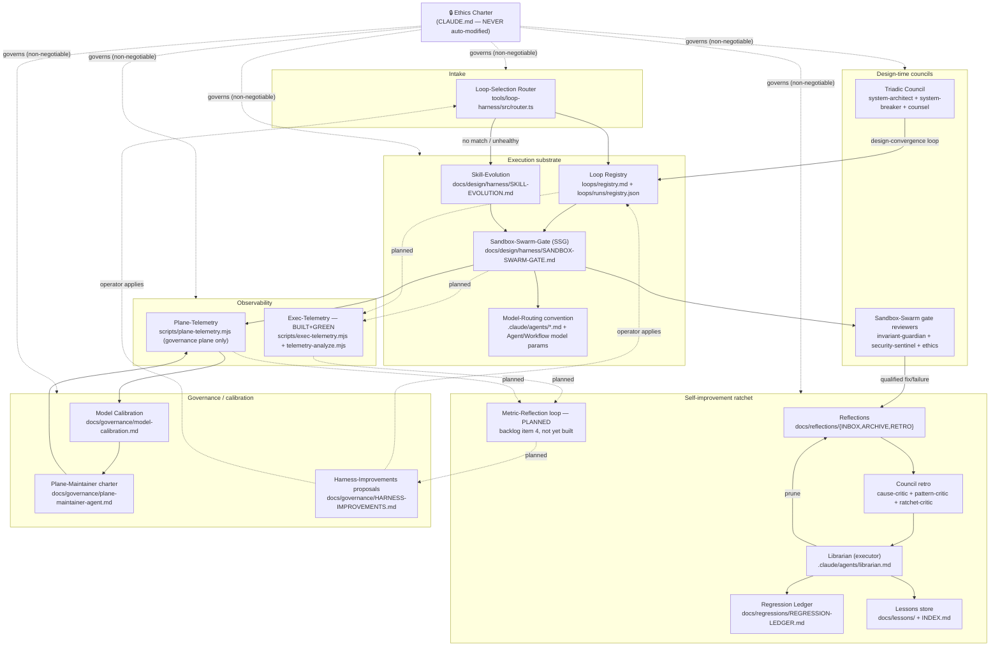

# Harness Systems Map

> **Status:** living document — update whenever a subsystem is added, promoted, deprecated, or
> re-wired. This is a **map, not an authority**: it describes what exists and how it connects; it
> grants no permission and enforces nothing itself (the gates/hooks/tests it describes do that).
> **Owner:** whichever agent/session last edited a subsystem also updates this map in the same
> change — no separate "docs sync" step.
> Backlog item 2 of the autonomous-continuation run (`docs/governance/AUTONOMOUS-STATUS.md`).

## 1. Why this exists

The harness has grown a dozen semi-independent subsystems (loop registry, sandbox-swarm-gate,
skill-evolution, the regression ledger, reflections/councils, plane-telemetry, model-routing
convention, the loop-selection router) each documented in its own file, cross-referencing each
other by prose. Nothing shows the whole graph in one place, or says plainly which parts are
**built and green** vs **designed but not yet built**. This document is that one place.

**Read this together with, never instead of:** `CLAUDE.md` (the standing rules these subsystems
implement), `loops/registry.md` (the loop-instance table), `docs/regressions/REGRESSION-LEDGER.md`
(the ratchet's actual rows), `docs/reflections/README.md` (the reflection/retro mechanics).

## 2. Graph

## 3. System table

Legend for **Status**: 🟢 BUILT+GREEN (has red→green proof, running) · 🟡 DESIGNED (doc/ADR exists,
partially built) · 🔴 PLANNED (backlog item only, not started).

| System | Subsystem | Purpose | Inputs | Outputs | Owner | Status | Store path |
|---|---|---|---|---|---|---|---|
| **Ethics Charter** | — | Non-negotiable standing rule set (no military use, no war-as-only-option, peace-for-everyone, AI-as-commons). Every other node's authority is subordinate to this one. | Operator-authored text only | Refusal/escalation on conflicting requests | Operator (human) | 🟢 BUILT+GREEN | `.claude/CLAUDE.md` (Ethics Charter section) — **never auto-modified by any agent, per this map's own standing rule** |
| **Loop-Selection Router** | intake classifier | On every command: classify DIRECT / RUN-existing / BUILD-new / BOUNCE via the 4-condition test (repeats? DoD+verification? budget? tools to do+verify?) | User/agent prompt | Route decision; dispatch to a registry loop or loop-architect | operator (`UserPromptSubmit` hook) + `tools/loop-harness/src/router.ts` | 🟢 BUILT+GREEN | `tools/loop-harness/src/router.ts`, spec `docs/operating-model/loop-selection-router-v1.md`, enforcement `tools/loop-harness/router-hook.sh` |
| **Loop Registry** | loop-instance table | Source of truth for every loop's id/intent/version/status/card/report/memory/trigger | `loops/<id>.yaml` cards, `/build-verify-loop verify` certifications | CERTIFIED/DRAFT/REJECTED/DEPRECATED status per loop; machine registry for the router | operator + `loop-architect` agent | 🟢 BUILT+GREEN (16 loop cards; several still DRAFT pending cert) | `loops/registry.md` (source), `loops/runs/registry.json` (derived, `node scripts/loops-registry-sync.mjs`) |
| **Sandbox-Swarm-Gate (SSG)** | execution substrate | Formalizes worktree-isolated parallel-agent lanes + review gate before merge (Sandbox=throwaway worktree, Swarm=concurrent Agent/Workflow, Gate=quality+safety+ethics review) | A multi-lane build/audit task | Merged lanes (gate-green) or explicitly ABANDONED lanes; §5 LOOP REPORT | operator + `loop-architect` (cert pending) | 🟡 DESIGNED (doc + scaffold script; loop card is DRAFT awaiting `/build-verify-loop verify sandbox-swarm-gate`) | `docs/design/harness/SANDBOX-SWARM-GATE.md`, `scripts/sandbox-swarm-gate.mjs`, `loops/sandbox-swarm-gate.yaml` |
| **Skill-Evolution** | execution substrate | Third ratchet output (alongside guardrail/lesson): turn a recurring stable procedure into a reusable SKILL via find→use→expand→create; reuses SSG's sandbox+gate substrate | Recurring task procedures (≥2× recurrence + stable steps + checkable DoD) | Drafted skill under `docs/design/harness/proposed-skills/` (never self-installs into protected `.claude/skills/`) | operator + `loop-architect` (cert pending) | 🟡 DESIGNED (doc + one draft skill scaffold; loop card DRAFT) | `docs/design/harness/SKILL-EVOLUTION.md`, `docs/design/harness/proposed-skills/`, `loops/skill-evolution.yaml` |
| **Model-Routing convention** | execution substrate | Assigns model tier by agent role (doers=sonnet, reasoning=fable, review=opus) across `Agent`/`Workflow` calls and `.claude/agents/*.md` frontmatter | Task role (doer/reasoner/reviewer) | Model parameter on the spawned agent | whoever authors the agent/workflow call | 🟢 BUILT+GREEN (convention enforced by author discipline, not a standalone gate) | `.claude/agents/*.md` frontmatter; convention documented in `docs/design/harness/SANDBOX-SWARM-GATE.md` §"Swarm" |
| **Plane-Telemetry** | observability | Structured per-step telemetry (`emit`/`digest`/`predict`/`resolve`/`inbox`) for the plane-maintainer's own runs, plus the prediction-ledger calibration mechanism; **governance-plane-only by design** | `emit --kind <sense\|diagnose\|heal\|scout\|report> --outcome … --target … --detail …` calls from the plane-maintainer's charter steps | Append-only JSONL on the `telemetry/plane` orphan branch; Telegram digest; `inbox` uncertainty-first queue | plane-maintainer agent | 🟢 BUILT+GREEN (22/22 `node --test scripts/plane-telemetry.test.mjs`; ADR APPROVED) | `scripts/plane-telemetry.mjs` (+ `.test.mjs`), orphan branch `telemetry/plane`, working copy `loops/runs/`, ADR `docs/adr/ADR-plane-telemetry-and-calibration.md` |
| **Exec-Telemetry** | observability | General harness-wide append-only exec-history emitter (`{ts,layer,action_kind,name,duration_ms,tokens?,outcome,meta}`) + a bottleneck/pattern analyzer, distinct from plane-telemetry (that one is plane-maintainer-only; this one covers every layer's execution) | Every layer's action completion (loop run, agent call, gate pass/fail) — `node scripts/exec-telemetry.mjs emit --layer L --action-kind K --name N --outcome O --duration-ms N` | Append-only exec-history log (`loops/runs/exec-events-YYYY-MM.jsonl`, local scratch — no orphan-branch publish, unlike plane-telemetry); `node scripts/telemetry-analyze.mjs` bottleneck + recurring-failure report | *unassigned — autonomous-continuation run* | 🟢 BUILT+GREEN (13/13 `node --test scripts/exec-telemetry.test.mjs`, incl. a confirmed red→green canary on the recurring-failure threshold) | `scripts/exec-telemetry.mjs` (+ `.test.mjs`), `scripts/telemetry-analyze.mjs`, working copy `loops/runs/` (gitignored) |
| **Reflections + Council retro** | self-improvement ratchet | Worker writes atomic causal-WHY reflections on qualified fixes/failures; Council (cause-critic/pattern-critic/ratchet-critic) challenges + synthesizes; librarian enacts | `docs/reflections/INBOX/*.reflection.md` | Ledger row / lesson / prune-revision / CLAUDE.md pointer, or explicit no-op; processed reflections moved to `ARCHIVE/` | worker (writes) → council agents (deliberate) → `librarian` (enacts) | 🟢 BUILT+GREEN | `docs/reflections/{INBOX,ARCHIVE,RETRO}`, `docs/reflections/README.md` |
| **Regression Ledger (ratchet)** | self-improvement ratchet | Tier-1 authority: one row per bug class with a deterministic red→green guardrail; monotonic, never weakened | Confirmed council root / qualified fix | New ledger row + guardrail (eslint rule / boot-guard / migration check / E2E / CI-gate / unit test) | `librarian` (enacts), operator (reviews) | 🟢 BUILT+GREEN (71 rows, `node scripts/guardrail-ledger-integrity.mjs` green, max #68) | `docs/regressions/REGRESSION-LEDGER.md`, integrity check `scripts/guardrail-ledger-integrity.mjs` |
| **Lessons store** | self-improvement ratchet | Tier-2 advisory: point-in-place pre-edit warnings injected by trigger, distilled from reflections that don't rise to a guardrail | Council retro output below the guardrail bar | `docs/lessons/{date}-{slug}.md` + `INDEX.md` entry; injected pre-edit via `pre-edit-lessons` hook (advisory only) | `librarian` | 🟢 BUILT+GREEN | `docs/lessons/*.md`, `docs/lessons/INDEX.md` |
| **Metric-Reflection loop** | self-improvement ratchet | Folds telemetry (plane + exec, once exec-telemetry exists) and git history into cross-run insights (patterns, cross-patterns, historical comparison), written as a governance report that feeds the ratchet | Plane-telemetry digests, exec-telemetry log (once built), `git log` | `docs/governance/*` insight report → ratchet candidates | *unassigned — backlog item 4* | 🔴 PLANNED (not started; depends on Exec-Telemetry) | target: a `loops/` DRAFT card + a `scripts/` helper (backlog item 4) |
| **Triadic Council** | design-time council | Pre-code hardening of a serious change (schema/contract/money/RLS/auth/state-machine/WS/integration/irreversible): system-architect proposes, system-breaker attacks, counsel judges ethics/aesthetics/strategy | A design proposal | ADR + threat-model + counsel-opinion + decision log; APPROVED/REJECTED/DEFERRED | `system-architect`, `system-breaker`, `counsel` agents | 🟢 BUILT+GREEN (loop `design-convergence`, CERTIFIED — report lost, re-cert via `/build-verify-loop verify`) | `.claude/agents/{system-architect,system-breaker,counsel}.md`, `docs/adr/`, `loops/design-convergence.yaml`, trigger `/council` |
| **SSG reviewers (Gate)** | design-time council | Per-sandbox-lane merge gate: quality (typecheck/build/Mandatory-Proof/no-false-green) + safety (`invariant-guardian`, `security-sentinel`, red-line human-approval) + ethics (Charter, non-negotiable) | A sandbox lane's diff | PASS→merge or REJECT→back to sandbox | `invariant-guardian`, `security-sentinel` agents + human (red-lines) | 🟡 DESIGNED (same cert-pending status as SSG itself) | `docs/design/harness/SANDBOX-SWARM-GATE.md` §4 |
| **Plane-Maintainer charter** | governance | Autonomous cloud agent's authority boundary + daily Sense→Diagnose→Heal→Scout→Report→Self-improve loop over the dev/ops plane (staging only) | Cron firing, `plane-guard.mjs`/`agent-health-pass.mjs` sense output | Staging fixes (gated, proof-carrying), telemetry emissions, reflections | plane-maintainer agent (operator-scheduled) | 🟢 BUILT+GREEN | `docs/governance/plane-maintainer-agent.md`, enforcement `scripts/plane-guard.mjs` |
| **Model Calibration** | governance | Mechanizes the operator's adaptation/connection/persuasion cycle as a prediction-ledger (predict → resolve → read the gap); advisory-forever, never a gate | `plane-telemetry.mjs predict`/`resolve` calls at each charter step | Calibration record (hit/miss/partial) feeding `result-vs-expectation` doubt trigger | plane-maintainer agent | 🟢 BUILT+GREEN (bound by a plane-guard HARD check keeping it un-gated) | `docs/governance/model-calibration.md`, data in `telemetry/plane` branch |
| **Harness-Improvements proposals** | governance | Exact PROPOSED diffs to reduce harness friction (e.g. move Docker build out of pre-commit, tier path guards, context-aware nudges, agent-init retry, research-lane token budgets) that the operator applies by hand (protected files) | Observed friction in the harness (gate false-positives, slow pre-commit, etc.) | A reviewable diff document; operator applies or rejects | *unassigned — backlog item 5* | 🔴 PLANNED (not started) | target: `docs/governance/HARNESS-IMPROVEMENTS.md` (backlog item 5) |

## 4. Dynamic meta-controller

> **What this section is:** a design for a *gated* loop that lets the harness correct or extend its
> own subsystem graph when a VERIFIED final output reveals a gap — not a system that exists yet.
> Nothing below grants any agent new authority; every step routes through gates that already exist.

**Trigger.** A subsystem output that has already passed its own verification (a CERTIFIED loop
report, a green guardrail run, a resolved Council retro, a plane-telemetry `digest`) nonetheless
*reveals*, in its own content, that the systems map is wrong or incomplete — e.g. a retro
repeatedly routes a finding to "no actionable artifact" because no subsystem owns that class of
problem; a loop's memory file shows recurring health failures that no existing gate catches; a
calibration `miss` keeps recurring on the same target with no subsystem tracking it.

**The loop (each step is DoD-separate-from-method, per the calibration §2 discipline):**

1. **Detect** — a verified output names the gap explicitly (never inferred from vibes; it must
   cite the specific artifact — retro line, ledger row, loop-memory entry — that shows the miss).
2. **Propose** — the detecting agent (or the next `librarian`/Council pass) drafts either (a) a new
   subsystem entry for this map + a `loops/` DRAFT card, or (b) a correction to an existing row
   (status, owner, store-path) — never both broadened and vague; pick one.
3. **Gate** — the proposal goes through the **same substrate every code change goes through**:
   SSG's quality+safety+ethics gate if it touches code/scripts, or the Triadic Council
   (`design-convergence` loop, `/council`) if it's structural/design-only. **No self-approval path
   exists or may be added** — a subsystem cannot certify its own extension.
4. **Remap** — on gate-PASS, this document is updated in the same change (§1's rule: whoever
   changes a subsystem updates the map). The mermaid graph and table rows above are the living
   artifact; there is no separate "meta-controller state file" to keep in sync.
5. **Ratchet** — the new/corrected subsystem is itself now subject to §3's Status legend: it starts
   at 🔴 PLANNED or 🟡 DESIGNED like any other row, and only becomes 🟢 BUILT+GREEN with its own
   red→green proof. The meta-controller does not get to mark its own output BUILT+GREEN by fiat.

**Standing exclusion (non-negotiable, restated from CLAUDE.md's own text):** the **Ethics Charter
node in §2's graph can never be a target of step 2–5** above. No detected gap, no proposal, no
gate-pass, however verified, may modify, relax, reinterpret, or remap the Charter. A finding that
seems to call for changing the Charter is not a meta-controller task — it is a stop-and-escalate-
to-human event, full stop, same as any other Ethics-Charter conflict in `.claude/CLAUDE.md`.

## 5. Known gaps in this map (honesty, not aspiration)

- **Exec-Telemetry** is now 🟢 BUILT+GREEN (backlog item 3 — `scripts/exec-telemetry.mjs` +
  `scripts/telemetry-analyze.mjs`, red→green tested). **Metric-Reflection** is still 🔴 PLANNED —
  this map documents its intended shape (per the backlog that motivated this document) so the
  graph is complete, but no code exists yet; building it is backlog item 4 of the same
  autonomous-continuation run that wrote this map (`docs/governance/AUTONOMOUS-STATUS.md`). It
  depends on Exec-Telemetry's log, which now exists — do not treat its table row above as a claim
  that it runs today.
- **SSG** and **Skill-Evolution** are 🟡 DESIGNED, not certified — their loop cards are DRAFT and
  will not be dispatched by the router until `/build-verify-loop verify <id>` returns CERTIFIED.
- Several CERTIFIED loops (`error-fix-convergence`, `design-convergence`, `autoupgrade`) show
  "report LOST — re-cert via `/build-verify-loop verify`" in `loops/registry.md`; this map inherits
  that caveat rather than papering over it.
