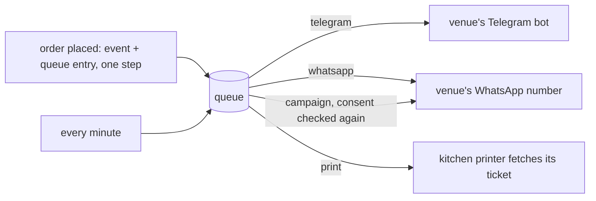

# Integrations

Everything below belongs to the venue: its own bot, its own Meta account, its own bucket, its own
keys. dowiz holds no shared platform account for any of them. Console, **More, Integrations** shows
whether each one is set up and has a **prove it** button that checks it for real without sending
anything to a customer (Telegram's `getMe`, the WhatsApp number's record, the Instagram username, the
webhook handshake, a one-line test object in the bucket, the MCP tool list, the presence of the
Stripe keys). On failure it shows the provider's own words.

## The message queue (outbox)

A message the venue owes someone (the kitchen bell, a WhatsApp reply, a campaign message, a printer
ticket) is written in the same step as the event that caused it, and sent afterwards. Every minute
the queue is drained. A failed send is retried after 10 s, 30 s, 2 min, 5 min and then 10 min, and
given up after six tries; the queue's depth and oldest entry show on **More, System health**. An
order never fails because its message failed.

## Telegram (the kitchen bell)

The venue creates its own bot with Telegram's BotFather and pastes the token under **More,
Notifications**. New orders go to the venue's chosen chat.

## WhatsApp and Instagram

Both arrive through one Meta webhook. Incoming messages appear in the console's **Messages** inbox,
and replies go out through the queue. **Campaigns** send approved WhatsApp templates to customers who
consented, and consent is checked again at the moment of sending, not only when the campaign was
created.

## Kitchen printer

**More, Kitchen printer**: name a printer and create a key for it. A printer that speaks CloudPRNT
fetches its own tickets from the venue's address, so no port needs opening in the restaurant. Each
order in the console shows its ticket as queued, printing, printed or failed.

## Nightly copy to your own bucket

**More, Cloud storage** connects an S3-compatible bucket the venue owns. Every night the venue's
data is copied there with a manifest of each file's SHA-256. Copies are kept for 7 days, then one a
week until 21 days, then removed. A copy can also be sent at once.

## eBills (import only)

dowiz can read the venue's sales from its certified fiscal till on ebills.al, so dine-in sales rung up
on the till land in the same order log as online orders (and draw down stock the same way). This is
**one direction only**: dowiz reads from eBills and never sends invoices to it. Amounts are whole lek,
and a sale whose words dowiz does not recognise is refused rather than guessed. Set up under **More,
eBills**.

## The assistant

**More, Assistant** points dowiz at the venue's own AI endpoint. The assistant answers questions
about the venue from its records; it can read what it is shown and cannot change anything. Couriers
can ask it about their own deliveries.

## Agents over MCP

The venue can be driven by an AI agent (Claude Desktop, Claude Code, Cursor, or any client that
speaks the Model Context Protocol) at `https://<venue>.dowiz.org/api/mcp`. The agent authenticates
with an API key made under **More, API keys**. Each tool is the same call the console makes, so an
agent can do exactly what the console can and nothing more. **More, Agents (MCP)** shows the setup.

## Stripe

Card payments use the venue's own Stripe account (**More, Payments**). See
[Payments and the till](Payments-and-Till.md).
