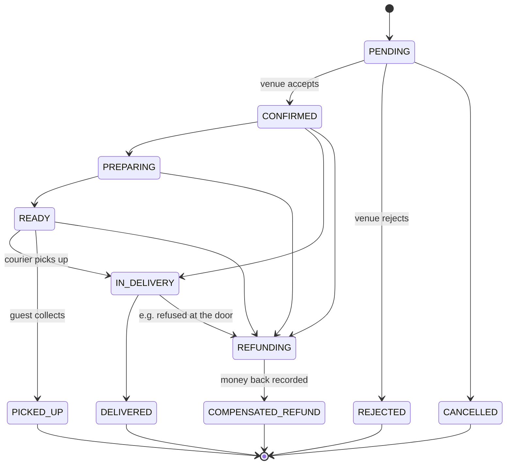

# Orders and delivery

Every order, whether it came from the storefront, a table QR code, a waiter or an aggregator entered
by hand, is one record in the venue's order log, and its status is worked out from the events in
that log. A move that the rules below do not allow is refused with an error; it is never silently
ignored.

## Statuses

From `allowed_next` in `crates/dowiz-core/src/order_machine.rs`:

| Status | Means | Who moves it on |
|---|---|---|
| `PENDING` | placed, not yet accepted | owner (accept or reject); a waiter confirms a guest's table round |
| `CONFIRMED` | accepted | owner or kitchen |
| `PREPARING` | in the kitchen | owner or kitchen |
| `READY` | waiting for a courier or the guest | owner assigns a courier; the courier takes it |
| `IN_DELIVERY` | with the courier | the courier |
| `DELIVERED`, `PICKED_UP` | done; final | nobody |
| `REJECTED`, `CANCELLED` | ended before any work; final | nobody |
| `REFUNDING`, `COMPENSATED_REFUND` | being refunded, refunded; the second is final | owner records the money back |

`SCHEDULED` exists as a word but every move into or out of it is refused; scheduled orders are not
built.

**An order past `PENDING` ends through a refund.** `DELIVERED` and `PICKED_UP` are final by design:
once food has been handed over, the sale stands.

## Price and waiting time

The storefront shows a total and a waiting time before the guest sends the order. Both are computed
on the server by the same code that takes the order: the price from the venue's menu and delivery
terms, in integer minor units (no rounding drift), and the waiting time in whole minutes from the
venue's own kitchen profile and current queue (`workers/api/src/eta.rs`). A total sent by a browser
is never trusted.

## The guest's key

Placing an order returns a key to the guest's phone. Reading the order needs that key: the order
number alone opens nothing (`GET /api/order/:id` without it answers 401 or 404).

## Delivery

1. The order reaches `READY`.
2. The owner assigns a courier, or a courier on shift takes it from the list.
3. The courier picks it up (`IN_DELIVERY`) and delivers it (`DELIVERED`), recording the cash taken
   for a cash order; or records "refused at the door", which moves it to `REFUNDING`.

The guest follows the courier on a map in the storefront's **Orders** tab.

## Messages the order owes

Telling the kitchen (Telegram, printer) is written in the same step as the order itself and sent
afterwards by a queue that retries. If Telegram is down, the order still stands and the message
follows. See [Integrations](Integrations.md).
