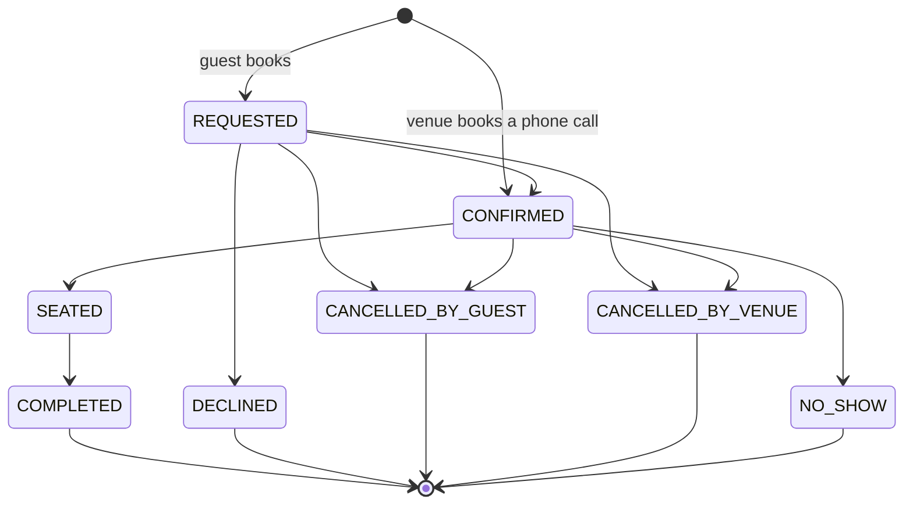

# Room, tables and bookings

## The floor plan

The owner draws the room in the console (**More, Floor plan**): rooms (zones) and tables. The room
app's **Floor** and the storefront's booking page both read this plan.

Each table on the Floor has one of six states, worked out from the open orders and bookings, never
typed in by hand: **Free**, **Booked**, **Ordering**, **Waiting for food**, **Paying**, **To clear**.

## Table QR codes

**More, Table QR codes** prints a signed QR code per table. A guest who scans it orders from their
own phone; the round joins that table's open bill and waits for a waiter to confirm it. A link for
one table cannot be edited into a link for another: the signature would no longer match.

## Sittings and rounds

- A **sitting** is one party at one table, from opening the table to paying and clearing it.
- A **round** is one order sent to the kitchen during a sitting. A sitting has as many rounds as
  the table orders; the bill is always worked out from its rounds, never stored separately.
- Changes to a round are made as intentions (add, remove, change a count, comp), each numbered from
  the version the waiter was looking at. Two tablets editing the same round cannot overwrite each
  other: the second, stale change is refused and the tablet reloads.
- Lines can move between rounds until the kitchen has the round; a whole sitting can move to another
  table.

How to do each of these in the app: [Waiter](Waiter.md).

## Bookings

A guest books from the storefront's **Table** tab without an account (see [Guest](Guest.md)); the
owner books a phone call from the console (**More, Bookings**). A guest's booking starts as a
request; a booking the venue enters is confirmed at once.

From `allowed_next` in `crates/dowiz-core/src/reservation.rs`:

- Nothing erases a booking. "Delete" in the console is `CANCELLED_BY_VENUE`, one more event; the
  booking and its history stay.
- The guest's booking comes with a **share link**. Anyone holding it can see the booking and cancel
  it, so it can be sent to the friend who is actually coming.
- A **confirmed** booking can issue a **pass**, which the venue can check at the door. A request the
  venue has not answered gets no pass.
